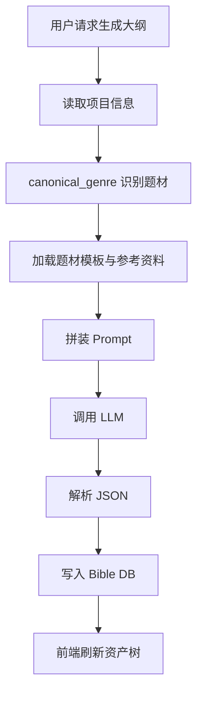
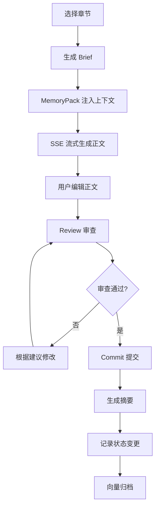
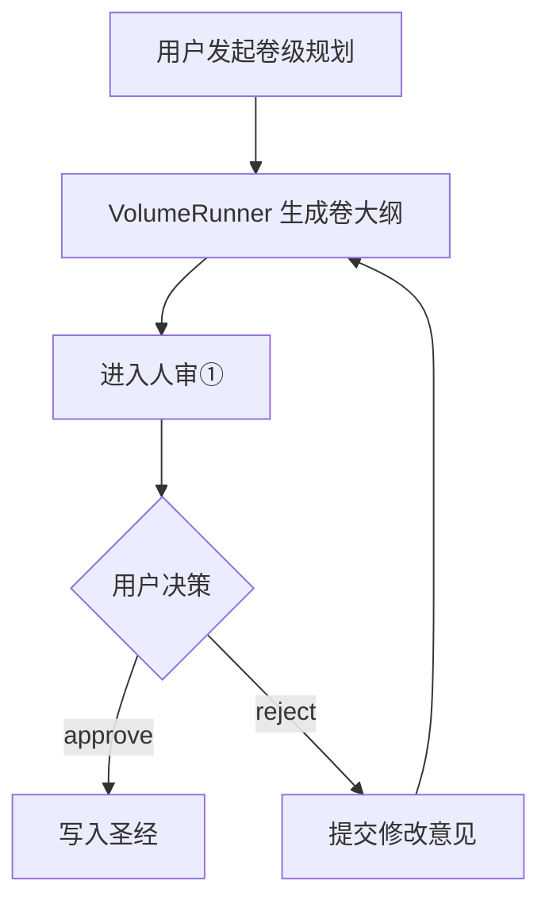

# 项目说明书：AI 长篇网文生成与一致性管理系统

> **文档版本：** v1.0
> **编写日期：** 2026-06-18
> **适用范围：** 开发、测试、运维、产品
> **文档状态：** 已完成系统验证与初稿编写

---

## 目录

1. [项目概述](#1-项目概述)
2. [功能模块详细说明](#2-功能模块详细说明)
3. [业务流程](#3-业务流程)
4. [数据结构定义](#4-数据结构定义)
5. [接口文档](#5-接口文档)
6. [用户操作指南](#6-用户操作指南)
7. [异常处理机制](#7-异常处理机制)
8. [技术架构说明](#8-技术架构说明)
9. [实施计划](#9-实施计划)

---

## 1. 项目概述

### 1.1 项目背景

当前网络文学创作者在创作长篇作品时，普遍面临以下痛点：

- **设定遗忘**：世界观、角色关系、伏笔线索在几十万字后容易前后矛盾
- **节奏失控**：支线过多或升级体系崩坏，导致读者流失
- **上下文受限**：单次 LLM 对话窗口有限，难以记住全书设定
- **重复劳动**：从灵感到大纲、从大纲到章节，需要大量人工串联

本项目旨在构建一套**AI 驱动的长篇网文生成与一致性管理系统**，通过多 Agent 协作、结构化圣经（Story Bible）、分层记忆（Memory Pack）与卷级规划（Volume Planning），将创作者从繁琐的设定管理中解放出来，同时保证长篇故事的内在一致性与节奏合理性。

### 1.2 核心目标

1. **降低创作门槛**：用户只需提供核心灵感，系统自动生成世界观、角色、大纲与章节
2. **保障长篇一致性**：通过状态审计、伏笔回收、Memory Pack 与 Archival Memory 实现跨章节追踪
3. **支持人机协作**：在关键节点（卷级规划、章节提交）引入人审，避免 AI 跑偏
4. **可扩展可维护**：模块化 Agent 架构，便于接入新题材、新模型与新交互方式

### 1.3 系统定位

| 维度 | 说明 |
|---|---|
| **产品形态** | Web 单页应用 + FastAPI 后端服务 |
| **目标用户** | 网文作者、编剧、同人创作者、AI 写作研究者 |
| **核心卖点** | “一本书一个项目、一次设定全局管理、一键卷级规划” |
| **技术特色** | 多 Agent 协作、LangGraph 工作流、Chroma 向量归档、题材模板约束 |

### 1.4 已完成功能清单

- [x] 项目生命周期管理（CRUD）
- [x] 圣经资产编辑：世界观、角色、伏笔、大纲
- [x] AI 生成世界观、角色、大纲
- [x] 章节写作任务书（Brief）生成
- [x] 章节一致性审查（Review）
- [x] 章节提交与事实沉淀（Commit）
- [x] Memory Pack 三层记忆（working/episodic/semantic）
- [x] Archival Memory 向量检索
- [x] 题材模板与参考资料库
- [x] 卷级规划后端（VolumeRunner + Human-in-the-loop）
- [x] 文件导入：txt/md/docx/pdf/图片等
- [x] 前端单页控制台

---

## 2. 功能模块详细说明

### 2.1 模块总览

```
┌─────────────────────────────────────────────────────────────┐
│                        前端客户端                           │
│  (React + TypeScript + Vite + Tailwind + shadcn/ui)        │
└───────────────────────┬─────────────────────────────────────┘
                        │ HTTP / SSE
┌───────────────────────▼─────────────────────────────────────┐
│                       FastAPI 后端                          │
│  ┌──────────┐ ┌──────────┐ ┌──────────┐ ┌──────────┐       │
│  │ Projects │ │  Bible   │ │Generation│ │ Chapters │       │
│  └──────────┘ └──────────┘ └──────────┘ └──────────┘       │
│  ┌──────────┐ ┌──────────┐ ┌──────────┐ ┌──────────┐       │
│  │ Planning │ │  Memory  │ │References│ │  Utils   │       │
│  └──────────┘ └──────────┘ └──────────┘ └──────────┘       │
└───────────────────────┬─────────────────────────────────────┘
                        │
        ┌───────────────┼───────────────┐
        ▼               ▼               ▼
   ┌─────────┐    ┌──────────┐    ┌──────────┐
   │SQLite   │    │ Chroma   │    │  LLM API │
   │ bible.db│    │向量归档库 │    │OpenAI兼容│
   └─────────┘    └──────────┘    └──────────┘
```

### 2.2 Project Management & Orchestration Agent

**职责：** 项目生命周期管理、任务分发、全局状态协调。

**对应后端模块：** `novel_agent/api/routes_projects.py`

**功能：**

| 功能 | 说明 |
|---|---|
| 创建项目 | 录入书名、题材、简介、文风 |
| 列出项目 | 返回所有项目的摘要信息 |
| 更新项目 | 修改书名、题材、简介、文风 |
| 删除项目 | 级联删除该项目的所有圣经数据、摘要、状态变更、提交记录 |

**关键设计：**
- 一本书对应一个项目，数据严格隔离在 SQLite 中
- 删除项目时前端必须重置 `activeTab` 与 `selectedAsset`，避免 UI 卡死

### 2.3 Worldbuilding & Structure Agent

**职责：** 管理世界观、角色、伏笔、大纲等结构化设定资产。

**对应后端模块：** `novel_agent/api/routes_bible.py`

#### 2.3.1 World Settings（世界观）

| 字段 | 类型 | 说明 |
|---|---|---|
| `id` | int | 主键 |
| `project_id` | int | 所属项目 |
| `category` | str | 分类，如“修炼体系”“地理”“势力” |
| `title` | str | 条目标题 |
| `content` | str | 详细内容 |

#### 2.3.2 Characters（角色）

| 字段 | 类型 | 说明 |
|---|---|---|
| `name` | str | 角色名（唯一标识） |
| `role` | str | 身份，如 protagonist / antagonist / supporting |
| `personality` | str | 性格 |
| `motivation` | str | 动机 |
| `background` | str | 背景 |
| `arc` | str | 角色弧线 |
| `current_location` | str | 当前位置 |
| `current_emotion` | str | 当前情绪 |
| `known_info` | str | 已知信息 |

#### 2.3.3 Foreshadows（伏笔）

| 字段 | 类型 | 说明 |
|---|---|---|
| `foreshadow_id` | str | 伏笔唯一 ID |
| `tier` | str | 层级：主线/支线/细节 |
| `description` | str | 描述 |
| `plant_chapter` | int | 埋下章节 |
| `planned_resolve_chapter` | int | 计划回收章节 |
| `status` | str | 状态：pending / resolved / abandoned |

#### 2.3.4 Outlines（大纲）

| 字段 | 类型 | 说明 |
|---|---|---|
| `id` | int | 主键 |
| `level` | str | 层级：act / arc / chapter |
| `parent_id` | int | 父节点 ID |
| `order` | int | 同级排序 |
| `act` | str | 所属卷 |
| `title` | str | 标题 |
| `summary` | str | 摘要 |
| `strand` | str | 叙事线：quest / fire / constellation |

**strand 设计：**

- **quest（主线）**：主角目标驱动，如升级、复仇、寻宝
- **fire（情感/爆点）**：冲突、悬念、情感高潮
- **constellation（世界观）**：背景揭秘、世界观展开

每个章节大纲可标记 strand，确保叙事节奏平衡。

### 2.4 Content Generation Agent

**职责：** 生成世界观、角色、大纲与章节正文。

**对应后端模块：** `novel_agent/api/routes_generation.py`、`novel_agent/api/routes_chapters.py`

#### 2.4.1 资产生成

| 端点 | 功能 |
|---|---|
| `POST /api/generation/world/generate` | 根据需求生成世界观设定 |
| `POST /api/generation/characters/generate` | 生成主角、配角、反派 |
| `POST /api/generation/outlines/generate` | 生成卷/章大纲与配套伏笔 |

**生成逻辑：**
1. 读取项目信息（题材、简介、文风）
2. 通过 `canonical_genre` 识别题材关键词
3. 加载题材模板（如“玄幻修仙.md”）与参考资料
4. 将模板约束注入 prompt
5. 调用 LLM 生成结构化 JSON
6. 写入圣经数据库

#### 2.4.2 章节生成

| 端点 | 功能 |
|---|---|
| `POST /api/generation/chapter/brief` | 生成章节写作任务书 |
| `POST /api/generation/chapter/review` | 审查章节一致性 |
| `POST /api/generation/chapter/commit` | 提交章节并沉淀事实 |
| `GET /api/chapters/generate/stream` | SSE 流式生成章节正文 |

**章节工作流：**

```
选择章节 → 生成 Brief →  writers write → Review 审查 → Commit 提交
```

**Brief 注入内容：**
- 项目信息、本章大纲、活跃伏笔
- 角色状态快照、世界观快照
- 题材模板约束、参考资料
- 近期章节摘要（Episodic Memory）

**Review 五维检查：**
1. 角色一致性
2. 世界观一致性
3. 伏笔一致性
4. 时间线一致性
5. 风格一致性

**Commit 沉淀内容：**
- 章节摘要（ChapterSummary）
- 角色状态变更（StateChange）
- 向量归档（ArchivalMemory）

### 2.5 Quality Assurance & Review Agent Suite

**职责：** 多维度审查生成内容质量。

**对应后端模块：** `novel_agent/api/routes_generation.py` 中的 review 逻辑

| Agent | 职责 |
|---|---|
| Editorial Refinement Agent | 语言润色、节奏优化、修辞提升 |
| Continuity Verification Agent | 情节连贯性、角色连续性、时间线一致性 |
| Logical Coherence Agent | 逻辑漏洞、设定冲突、AI 幻觉检测 |
| Narrative Quality Assessment Agent | 故事吸引力、情感冲击、文学价值评估 |

**实现方式：** 通过单一 `/chapter/review` 端点，由 LLM 同时输出五维评分与修改建议。未来可拆分为独立 Agent 并行调用。

### 2.6 Support & Enhancement Agent Suite

#### 2.6.1 Foreshadowing Management Agent

**职责：** 跟踪伏笔状态，确保 setup 与 payoff 对应。

**前端表现：** OutlinesView 中的“伏笔板”显示当前活跃伏笔及其计划回收章节。

#### 2.6.2 Style Consistency Agent

**职责：** 保持全书文风统一。

**实现方式：**
- 项目级 `style` 字段写入 prompt
- Memory Pack 的 semantic 层携带文风参考
- review 时检查风格一致性

#### 2.6.3 Knowledge Integration Agent

**职责：** 从参考资料库检索题材相关知识。

**实现方式：** `ReferenceSearch` 类根据 canonical genre 检索 CSV 参考表，注入 generation prompt。

#### 2.6.4 Genre Adherence Agent

**职责：** 确保内容符合题材套路与毒点规避。

**实现方式：**
- 15 个题材模板（`templates/genres/*.md`）
- 9 张 CSV 参考表（`references/csv/*.csv`）
- `canonical_genre` 函数将用户输入映射到标准题材

### 2.7 Memory & State Management

#### 2.7.1 Story Bible Database

**存储：** SQLite，文件为 `{project_data_dir}/bible.db`

**包含表：**

| 表名 | 用途 |
|---|---|
| `projects` | 项目元数据 |
| `world_settings` | 世界观设定 |
| `characters` | 角色卡 |
| `foreshadows` | 伏笔 |
| `outlines` | 大纲 |
| `chapter_summaries` | 章节摘要 |
| `state_changes` | 实体状态变更 |
| `commits` | 提交记录 |

#### 2.7.2 Memory Pack

**文件：** `novel_agent/memory/memory_pack.py`

**三层记忆：**

| 层级 | 内容 | 预算占比 |
|---|---|---|
| Working Memory | 项目信息、本章大纲、活跃伏笔、实体状态快照 | 30% |
| Episodic Memory | 近期章节摘要、状态变更、关键事件 | 40% |
| Semantic Memory | 题材模板、参考资料、世界观、角色卡 | 30% |

**作用：** 控制 LLM 上下文预算，防止长故事上下文溢出。

#### 2.7.3 Archival Memory

**文件：** `novel_agent/memory/archival.py`

**技术：** Chroma 向量数据库

**用途：**
- commit 时将章节正文向量化存储
- 生成新章节前检索相关历史片段
- 支持语义搜索，弥补 Memory Pack 截断丢失的细节

### 2.8 Planning Agent

**职责：** 卷级大纲规划与人审循环。

**对应后端模块：** `novel_agent/api/routes_planning.py`、`novel_agent/planning/runner.py`

**工作流：**

```
用户发起卷级规划
    │
    ▼
VolumeRunner 调用 LLM 生成卷大纲、角色、伏笔
    │
    ▼
进入 Human Review ①（人审①）
    │
    ├── 用户 approve → 写入圣经 → 结束
    └── 用户 reject → 提交修改意见 → 重新生成 → 再次人审
```

**当前状态：** 后端已实现，前端缺少对应工作台。

---

## 3. 业务流程

### 3.1 项目创建与初始化流程


### 3.2 资产生成流程



### 3.3 章节生成与提交流程



### 3.4 卷级规划流程



---

## 4. 数据结构定义

### 4.1 核心模型关系

```
Project (1)
  ├── WorldSetting (N)
  ├── Character (N)
  ├── Foreshadow (N)
  ├── Outline (N)
  ├── ChapterSummary (N)
  ├── StateChange (N)
  └── CommitRecord (N)
```

### 4.2 Project

```python
class Project(Base):
    __tablename__ = "projects"
    id: int = Column(Integer, primary_key=True)
    title: str = Column(String)
    genre: str = Column(String)
    summary: str = Column(String)
    style: str = Column(String)
    created_at: datetime
    updated_at: datetime
```

### 4.3 Character

```python
class Character(Base):
    __tablename__ = "characters"
    id: int
    project_id: int
    name: str  # 唯一
    role: str
    personality: str
    motivation: str
    background: str
    arc: str
    current_location: str
    current_emotion: str
    known_info: str
    created_at: datetime
    updated_at: datetime
```

### 4.4 Foreshadow

```python
class Foreshadow(Base):
    __tablename__ = "foreshadows"
    id: int
    project_id: int
    foreshadow_id: str  # 唯一
    tier: str
    description: str
    plant_chapter: int
    planned_resolve_chapter: int
    status: str
    created_at: datetime
    updated_at: datetime
```

### 4.5 Outline

```python
class Outline(Base):
    __tablename__ = "outlines"
    id: int
    project_id: int
    level: str  # act / arc / chapter
    parent_id: int
    order: int
    act: str
    title: str
    summary: str
    strand: str  # quest / fire / constellation
    created_at: datetime
    updated_at: datetime
```

### 4.6 ChapterSummary

```python
class ChapterSummary(Base):
    __tablename__ = "chapter_summaries"
    id: int
    project_id: int
    chapter: int
    title: str
    summary: str
    word_count: int
    characters_present: list[str]
    locations: list[str]
    events: list[str]
    created_at: datetime
    updated_at: datetime
```

### 4.7 StateChange

```python
class StateChange(Base):
    __tablename__ = "state_changes"
    id: int
    project_id: int
    chapter: int
    entity_type: str  # character / world / foreshadow
    entity_key: str
    field: str
    old_value: str
    new_value: str
    reason: str
    created_at: datetime
```

---

## 5. 接口文档

### 5.1 接口总览

| 模块 | 数量 | 说明 |
|---|---|---|
| Projects | 5 | 项目 CRUD |
| Bible | 23 | 圣经资产 CRUD + 导入 |
| Generation | 7 | AI 生成与审查 |
| Chapters | 7 | 章节读写、流式生成、导出 |
| Planning | 2 | 卷级规划与人审 |

### 5.2 Projects API

#### POST /api/projects

创建项目。

**请求体：**
```json
{
  "title": "斗破苍穹",
  "genre": "玄幻修仙",
  "summary": "少年萧炎逆袭成帝",
  "style": "热血、节奏快、打脸爽文"
}
```

**响应：**
```json
{
  "id": 1,
  "title": "斗破苍穹",
  "genre": "玄幻修仙",
  "summary": "少年萧炎逆袭成帝",
  "style": "热血、节奏快、打脸爽文",
  "created_at": "2026-06-18T10:00:00",
  "updated_at": "2026-06-18T10:00:00"
}
```

#### GET /api/projects

列出所有项目。

**响应：**
```json
[
  {
    "id": 1,
    "title": "斗破苍穹",
    "genre": "玄幻修仙",
    "summary": "少年萧炎逆袭成帝",
    "style": "热血、节奏快、打脸爽文"
  }
]
```

#### GET /api/projects/{id}

获取单个项目详情。

#### PUT /api/projects/{id}

更新项目信息。

#### DELETE /api/projects/{id}

删除项目并级联清空数据。

### 5.3 Bible API

#### World Settings

- `GET /api/bible/{project_id}/world-settings`
- `POST /api/bible/{project_id}/world-settings`
- `PUT /api/bible/{project_id}/world-settings/{setting_id}`
- `DELETE /api/bible/{project_id}/world-settings/{setting_id}`

#### Characters

- `GET /api/bible/{project_id}/characters`
- `POST /api/bible/{project_id}/characters`
- `PUT /api/bible/{project_id}/characters/{name}`
- `DELETE /api/bible/{project_id}/characters/{name}`

#### Foreshadows

- `GET /api/bible/{project_id}/foreshadows`
- `POST /api/bible/{project_id}/foreshadows`
- `PUT /api/bible/{project_id}/foreshadows/{foreshadow_id}`
- `DELETE /api/bible/{project_id}/foreshadows/{foreshadow_id}`

#### Outlines

- `GET /api/bible/{project_id}/outlines`
- `POST /api/bible/{project_id}/outlines`
- `PUT /api/bible/{project_id}/outlines/{outline_id}`
- `DELETE /api/bible/{project_id}/outlines/{outline_id}`

#### Summaries

- `GET /api/bible/{project_id}/summaries` — 列出章节摘要
- `DELETE /api/bible/{project_id}/summaries/{chapter}` — 删除指定章节摘要

#### Import

- `POST /api/bible/{project_id}/import-document` — 自然语言文档导入
- `POST /api/bible/{project_id}/import-file` — 文件上传导入（multipart/form-data）
- `POST /api/bible/{project_id}/import` — 结构化 JSON 批量导入

### 5.4 Generation API

#### POST /api/generation/world/generate

生成世界观。

```json
{
  "project_id": 1,
  "requirements": "高武世界，宗门林立",
  "style": "热血"
}
```

#### POST /api/generation/characters/generate

生成角色。

```json
{
  "project_id": 1,
  "protagonist_count": 1,
  "supporting_count": 3,
  "antagonist_count": 2,
  "style": "热血"
}
```

#### POST /api/generation/outlines/generate

生成大纲与伏笔。

```json
{
  "project_id": 1,
  "act": "卷一",
  "chapters": 30,
  "style": "热血"
}
```

#### POST /api/generation/chapter/brief

生成章节写作任务书。

```json
{
  "project_id": 1,
  "chapter": 1,
  "title": "开篇"
}
```

**响应：**
```json
{
  "chapter": 1,
  "title": "开篇",
  "goals": ["目标1", "目标2"],
  "key_beats": ["情节点1", "情节点2"],
  "tone": "热血",
  "constraints": ["约束1"],
  "context_stats": {
    "working": 1200,
    "episodic": 3400,
    "semantic": 2800
  }
}
```

#### POST /api/generation/chapter/review

审查章节。

```json
{
  "project_id": 1,
  "chapter": 1,
  "content": "章节正文..."
}
```

**响应：**
```json
{
  "scores": {
    "character": 9,
    "world": 8,
    "foreshadow": 7,
    "timeline": 9,
    "style": 8
  },
  "issues": ["问题1", "问题2"],
  "suggestions": ["建议1"]
}
```

#### POST /api/generation/chapter/commit

提交章节。

```json
{
  "project_id": 1,
  "chapter": 1,
  "title": "开篇",
  "content": "章节正文..."
}
```

**响应：**
```json
{
  "success": true,
  "summary": {"chapter": 1, "title": "开篇", "summary": "...", "word_count": 3200},
  "state_changes": [{"entity_type": "character", "entity_key": "萧炎", "field": "current_location", "new_value": "乌坦城"}],
  "archived": true
}
```

#### POST /api/generation/genre-context

查询题材上下文。

```json
{
  "project_id": 1
}
```

**响应：**
```json
{
  "canonical_genre": "玄幻修仙",
  "template": "...",
  "references": ["参考1", "参考2"]
}
```

### 5.5 Chapters API

- `GET /api/chapters/list` — 列出章节
- `GET /api/chapters/{chapter}/text` — 读取章节正文
- `PUT /api/chapters/{chapter}/text` — 保存章节正文
- `DELETE /api/chapters/{chapter}` — 删除章节
- `GET /api/chapters/generate/stream` — SSE 流式生成
- `GET /api/chapters/export/txt` — 导出 TXT

### 5.6 Planning API

#### POST /api/planning/run

启动卷级规划。

```json
{
  "project_id": 1,
  "volume": "卷一",
  "chapters": 30,
  "style": "热血"
}
```

**响应：**
```json
{
  "thread_id": "thread-xxx",
  "status": "awaiting_review",
  "result": {
    "characters": [...],
    "foreshadows": [...],
    "outlines": [...]
  }
}
```

#### POST /api/planning/resume

人审①决策。

```json
{
  "thread_id": "thread-xxx",
  "decision": "approve",
  "feedback": ""
}
```

或：

```json
{
  "thread_id": "thread-xxx",
  "decision": "reject",
  "feedback": "主角动机不足，反派太脸谱化"
}
```

---

## 6. 用户操作指南

### 6.1 快速开始

1. 打开 Web 客户端（默认 `http://localhost:5173`）
2. 点击“新建项目”，填写书名、题材、简介、文风
3. 进入项目后，在侧边栏选择：
   - **世界观** → 生成或手动录入
   - **角色** → 生成主角与配角
   - **大纲** → 生成卷级大纲
4. 切换到“章节”页，选择第 1 章
5. 点击“AI 生成”获取章节正文
6. 编辑后点击“审查”，根据建议修改
7. 点击“提交”沉淀事实

### 6.2 导入设定

1. 切换到“导入”页
2. 方式一：粘贴自然语言文档，点击“解析并导入”
3. 方式二：拖拽或点击上传文件（支持 txt/md/docx/pdf/图片）
4. 等待 AI 解析，查看导入统计
5. 切换到资产页确认生成结果

### 6.3 管理伏笔

1. 在“大纲”页查看“伏笔板”
2. 新增伏笔：填写 ID、层级、描述、埋下章节、计划回收章节
3. AI 生成大纲时会自动参考活跃伏笔
4. Commit 章节时系统会检查伏笔状态

### 6.4 卷级规划（待前端补齐）

1. 进入“卷级规划”页
2. 输入卷名与章节数
3. 点击“启动规划”
4. 查看生成的角色、大纲、伏笔
5. 点击“通过”写入圣经，或“打回”填写修改意见

---

## 7. 异常处理机制

### 7.1 后端异常

| 异常场景 | 处理方式 |
|---|---|
| LLM 超时 | 指数退避重试 3 次，最终返回 502 |
| LLM 配额超限 | 提取重置时间，返回友好错误 |
| LLM 鉴权失败 | 直接返回 401/403，不重试 |
| JSON 解析失败 | 尝试正则提取，失败返回 400 |
| 数据库迁移失败 | `migrate_db` 在启动时自动补齐新列 |
| 图片导入未开启 vision | 返回 400，提示配置 vision_enabled |

### 7.2 前端异常

| 异常场景 | 处理方式 |
|---|---|
| API 调用失败 | `showError` toast 提示 |
| 项目删除后状态异常 | 重置 activeTab 与 selectedAsset |
| LLM 生成中断 | 保留已生成内容，允许重试 |
| 文件类型不支持 | 前端 accept 限制 + 后端兜底解析 |

### 7.3 数据一致性保障

- 所有写操作成功后调用 `store.refreshAssets()`
- 删除项目时级联清空关联数据
- Commit 时生成摘要、状态变更、向量归档，形成完整审计链

---

## 8. 技术架构说明

### 8.1 后端技术栈

| 组件 | 用途 |
|---|---|
| FastAPI | Web 框架、API 路由、依赖注入 |
| SQLAlchemy 2.0 | ORM、数据库迁移 |
| SQLite | 项目与圣经数据持久化 |
| LangGraph | 卷级规划工作流与人审循环 |
| Chroma | 章节正文向量归档 |
| httpx | LLM HTTP 客户端 |
| python-docx / pymupdf / pillow | 文件内容提取 |

### 8.2 前端技术栈

| 组件 | 用途 |
|---|---|
| React 19 | UI 框架 |
| TypeScript | 类型安全 |
| Vite | 构建工具 |
| Tailwind CSS | 样式 |
| shadcn/ui | 组件库 |
| Zustand（store.ts） | 全局状态管理 |

### 8.3 LLM 架构

```
User Request
    │
    ▼
Context Builder (MemoryPack + ReferenceSearch)
    │
    ▼
Prompt Template (Genre Template + Instructions)
    │
    ▼
LLMClient (OpenAI-compatible, retry/fallback)
    │
    ▼
Response Parser (JSON extract / markdown)
    │
    ▼
BibleRepository / StateManager
```

### 8.4 目录结构

```
novel_agent/
├── api/                 # FastAPI 路由
├── bible/               # 数据模型与仓库
├── generation/          # 生成逻辑（含 world/character/outline）
├── llm/                 # LLM 客户端
├── memory/              # MemoryPack + ArchivalMemory
├── planning/            # VolumeRunner
├── references/          # 参考资料检索
├── templates/           # 题材模板
├── utils/               # 工具函数
└── config.py            # 配置加载

frontend/src/
├── api.ts               # API 封装
├── store.ts             # 全局状态
├── types.ts             # TypeScript 类型
├── App.tsx              # 主应用
└── components/          # 子组件
```

---

## 9. 实施计划

### Phase 0：前置任务（当前阶段）

- [x] 系统验证与测试
- [x] 项目说明书编写
- [x] 文件上传导入修复
- [ ] 前端工程化整理（拆分 App.tsx、统一错误处理、补齐类型）
- [ ] 补齐 API 与状态管理缺口（单项目详情、summaries、genre context）

### Phase 1：核心前端补全

- [ ] 卷级规划与人审①工作台
- [ ] 章节摘要浏览器
- [ ] 题材上下文展示面板
- [ ] 结构化批量导入

### Phase 2：体验与稳定性

- [ ] 错误处理统一化
- [ ] 加载状态优化
- [ ] 响应式布局适配
- [ ] 项目数据隔离（chapters/chroma 按项目分目录）

### Phase 3：高级能力

- [ ] 质量指标仪表盘
- [ ] 版本控制（Git 集成或内置快照）
- [ ] 多模型切换与配置面板
- [ ] 插件架构设计

---

## 附录 A：配置示例

```yaml
# config.yaml
project_data_dir: project_data
llm:
  base_url: https://api.openai.com/v1
  api_key: sk-xxx
  model: gpt-4o-mini
  temperature: 0.7
  max_tokens: 4000
  timeout: 180.0
  vision_enabled: false
```

## 附录 B：模型支持说明

- 视觉导入功能需要 LLM 支持 `image_url` 类型消息（OpenAI GPT-4o、Claude 3、Gemini 等）
- 如使用纯文本模型，请将 `vision_enabled` 保持为 `false`，此时图片导入将返回错误提示

## 附录 C：已知限制

1. 章节正文 `.md` 文件与 Chroma 向量库目前未按项目隔离
2. Memory Pack 采用按字符预算硬性截断，未引入重要性排序
3. 卷级规划后端为同步执行，长时间运行存在超时风险
4. 前端未暴露单项目详情查询、章节摘要管理、题材上下文等后端能力

---

**文档维护：** 本说明书应随每次重大功能迭代同步更新，确保开发、测试、运维三方信息一致。
